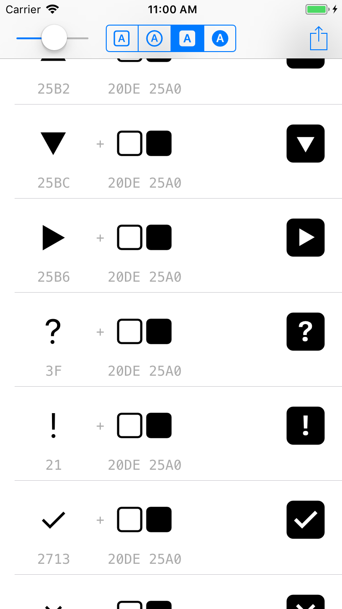

# SFGlyphs

Small iOS app to test combining characters with the San Francisco font.

By Cyrille Legrand <c.legrand@useradgents.com>

Inspired by [https://twitter.com/Tricertops/status/952265724789129216](https://twitter.com/Tricertops/status/952265724789129216)

### Usage

- Use the slider to change font size
- Use the segmented control to view another combiner
- Tap a single row to copy the resulting character to the Pasteboard
- Tap the Share button to export all possible combinations as a single text document (useful for sending to your computer or your designers)

